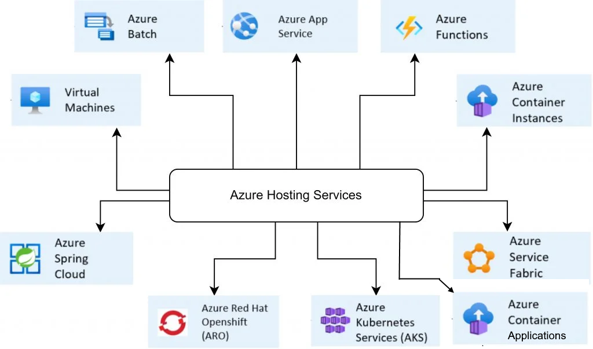
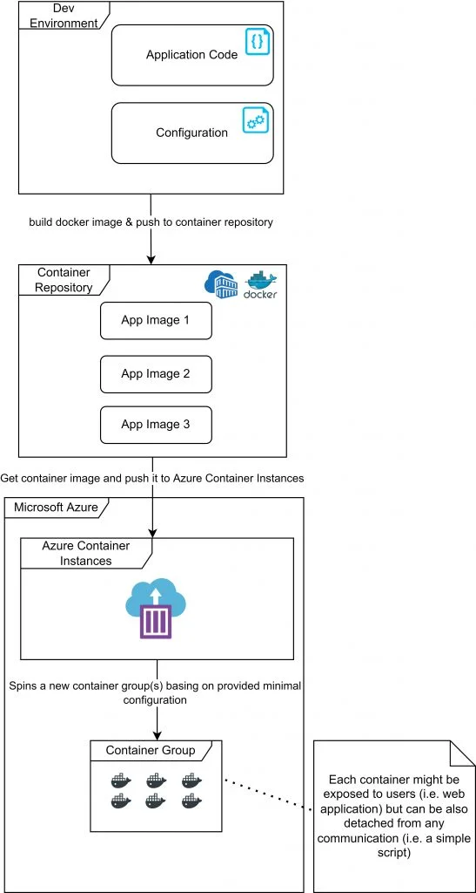
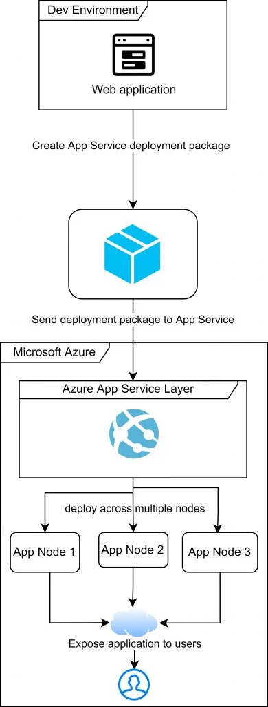

# ACI or AppSVC

For whatever reason Kubernetes is not your choice. Fine.

<!-- Microsoft Azure platform offers a wide range of services ready to use during creation and deployment processes of our containerized applications happening in the cloud.

Considering the multiplicity of available solutions – it is worth being aware of different hosting services (so-called Azure Compute Services, Hosting Services) details. This knowledge will greatly improve our ability to make a choice that matches our needs in terms of architectural decisions. -->

Here are probably all Azure Hosting Services:

Note: some of the hosting svcs above are by now (2023Q2) unquestionable legacy technologies.

<!-- ## Introduction to Microsoft Azure hosting services
Hosting services are categorized into groups because of different hosting models.

We can indicate following models:

- IaaS (Infrastructure as a service)
- PaaS (Platform as a Service)
- SaaS (Software as a service)
  
which determine the way of how the resources are being used in the cloud and what their usage scope is.

There are plenty of factors that can (and potentially should) affect our decisions, but during the early phase of research it can be crucial to answer questions such as:

- How much control do we need?
- Where do we want to use our application? (on-premise, hybrid cloud, public cloud)
- What will be the main way of usage? (continuous or on-demand usage)

Solutions from the IaaS group usually provide more control with simultaneous increased responsibility for created resources. On the other hand – SaaS solutions gives less control while freeing us from most resource-management related tasks.

The final choice targeting production should be always preceded by an analysis of different Azure services capabilities versus main goal and scope of designed software.
-->

What are the features, pros, cons, as well as differences between two Azure Hosting PaaS services used during development and deployment processes of containerized applications:

- Azure Container Instances (ACI)
- Azure App Service

> Azure Container Applications are a layer on top of AKS. Thus we will not discuss ACA, as I think there is no reason using ACA when AKS is available. 

# Azure Container Instances (ACI)
This service was created primarily with ease of use in mind. It supports both Windows and Linux containers. ACI provides very basic functionalities for creating and managing a group of containers. If our main target is to quickly start a new container with our application without going too deep into details related to configuration and orchestration – this will be the most common choice.

In most cases, using Azure Container Instances requires only: Providing a docker container image,
Specifying base configuration (number of required CPU cores or memory size)

Among key advantages of this service we can indicate:

- Fast startup time (usually couple seconds),
- Billing only for real usage (payment per second of service activeness) without any initial costs,
- No need for complex orchestration implementation,
- Providing container isolation level similar to security level provided by running applications on different virtual machines,
- Availability of public IP addresses for containers which can be accessible from Internet using FQDN (Fully Qualified Domain Name),
- Option to integrate with Azure Kubernetes Service,
- Option to deploy a group of containers ([**ACI Container Groups**](https://learn.microsoft.com/en-us/azure/container-instances/container-instances-container-groups)) on one host machine using shared storage space, shared network and other resources between containers working together towards one goal

  

  
  ACI group example

  That example container group:

- Is scheduled on a single host machine.
- Is assigned a DNS name label.
- Exposes a single public IP address, with one exposed port.
- Consists of two containers. One container listens on port 80, while the other listens on port 5000.
- Includes two Azure file shares as volume mounts, and each container mounts one of the shares locally.

Some of ACI disadvantages are:

- Limited scalability – in terms of scaling up – ACI provides options to define resources allocated for a container. However, scaling out requires manual creation and management of ACI instances. It also does not provide auto-scaling.
- Basic configuration – in certain scenarios it becomes a drawback (i.e. lack of port mapping functionality can force us to modify the code of the container to make it play well with ACI).
- 
Below you can see a simplified diagram presenting a deployment process of application using Azure Container Instances:

## Azure App Service

An service often called a „fully-featured” offering for hosting applications. 

Azure App Service provides access to every tool needed during development and deployment processes of web applications that are growing, and which business scope is constantly changing over time.

It offers a lot of integration capabilities in terms of other Azure services. Running containers with applications is only a small subset of overall App Services functionalities.

Think of this service as a framework providing you with necessary tooling for the whole software development cycle.

Azure App Service advantages worth mentioning are:

- High availability (guaranteed 99.5% availability basing on SLA contracts),
- Automatic or manual scaling in and out with option to specify the scaling rules,
- Load-balancing
- Built-in security mechanisms related to authentication and authorization processes (i.e. two-factor authentication)
- Support for many programming languages,
- Built-in SSL certificates management
- Great integration with IDE tools for deploying apps,
- **Deployment Slots** functionality which is free, and allows environment duplication – commonly used for testing application before going live,
- Support for code, container or even binaries based deployments

Some of this service disadvantages are:

- Complexity – forcing to learn about many details related with service operation,
- Dedicated mostly for web applications, other types of apps support is limited
  - only one container can be hosted on one Web App
- Usage of services delivered by one cloud provider (in this case Azure) not always translates into universal skills

Simplified diagram presenting deployment process of application using Azure App Service:

Web Application can be deployed as a container. Deployment across multiple nodes is optional. That  also means same web app or same container, deployed on multiple nodes.

## Create multiple apps on the same app service plan

> Please remember Container is just a unit of deployment of an WebApp (in this context).
>
> **Project can deploy multiple separate ‘WebApps’ under one ‘App Service Plan’.**
>
> All those WebApps (/websites) will have their own separate default domain (FQDN) and also devop can set custom domain for each of those WebApps. If required.
>
>The terminology:
>
>- **App Service** – Service which enables you to build and host web apps, mobile back ends, and  RESTful APIs. All optionally in containers.
>- **Apps**– Your individual Apps (WebApps in or out of containers), these apps run in App Service Plan.
>- **App Service Plan** - An App Service Plan (ASP) defines a set of compute resources for a web app to run.
>
> If multiple custom domains are required,  the ASP must be Shared plan or above tier to have ‘custom domain’ support. See, this doc. https://azure.microsoft.com/pricing/details/app-service/
>
> Since you pay for the computing resources your App Service plan allocates, you can potentially save money by putting multiple apps into one App Service plan. You can continue to add apps to an existing plan as long as the plan has enough resources to handle the load. 
>
> Keep in mind that apps in the same App Service plan all share the same compute resources.
>
> If those are required to be separate WebApps, it would be easier to manage separate WebApps than via virtual subdirectories/paths or hostname, or sub-domains. Using App Service Plan feature (provision many apps under the tier) to save cost.
>
>[Azure Web Site App with multiple custom domains](https://stackoverflow.com/questions/44347764/azure-web-site-app-with-multiple-custom-domains)
>
> To map a custom domain, see - [Map App Service domain to your app](https://learn.microsoft.com/azure/app-service/manage-custom-dns-buy-domain#map-app-service-domain-to-your-app)

## So, which one?

After analyzing the key features of both presented services, one can get an impression that they have some common parts. However, they were built for different purposes.

Azure Container Instances is a lightweight hosting service allowing us to quickly spin up a new container with our application. Its scope is usually well-known, and functionalities are rather basic. ACI might be a good choice if plans on expanding and scaling the application do not play a huge role, due to its predictable use.

For comparison – Azure App Service is some kind of an ecosystem providing suitable tools and elasticity. Similarly to ACI, it uses containerization for running applications but in addition focuses on the whole software development process, and will work perfectly for complex web applications that are growing constantly. Factors such as high availability, scalability or plenty of possible out of the box integrations are the top priority.

## Summary

In conclusion, the choice of proper hosting service depends mostly on the complexity of the application, plans for its further development, security concerns and many other aspects. This is why detailed analysis of architectural situation is needed, and will certainly help us to find solution tailored to the problem.  

---
(refactored from: https://devapo.io/blog/technology/azure-container-instances-vs-app-service/)
